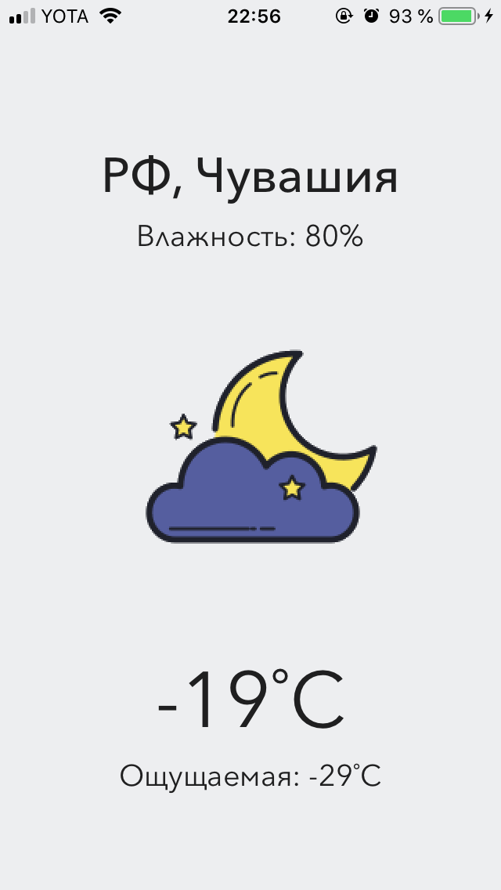

# Weather app with Alamofire
Приложение использует `CoreLoсation` для определения текущего местоположения, а так же _Alamofire, SwiftyJSON_ и _SVProgressHUD_.  
Для работы с приложением необходимо зарегистрироваться в двух сервисах, которые предоставляют API, получить ключи и присвоить соответствующим переменным в структуре apiKeys (класс ViewController) их значения.
Сервисы, предоставляющие API: 
1. [Dark Sky API](https://darksky.net/dev) используется для получения погоды по текущим координатам.
2. [OpenCage API](https://opencagedata.com) используется для получения страны и города по текущим координатам.

